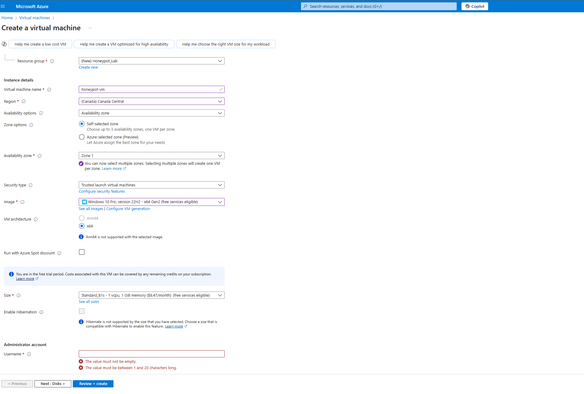
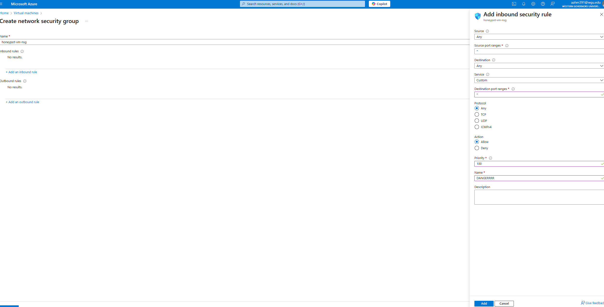
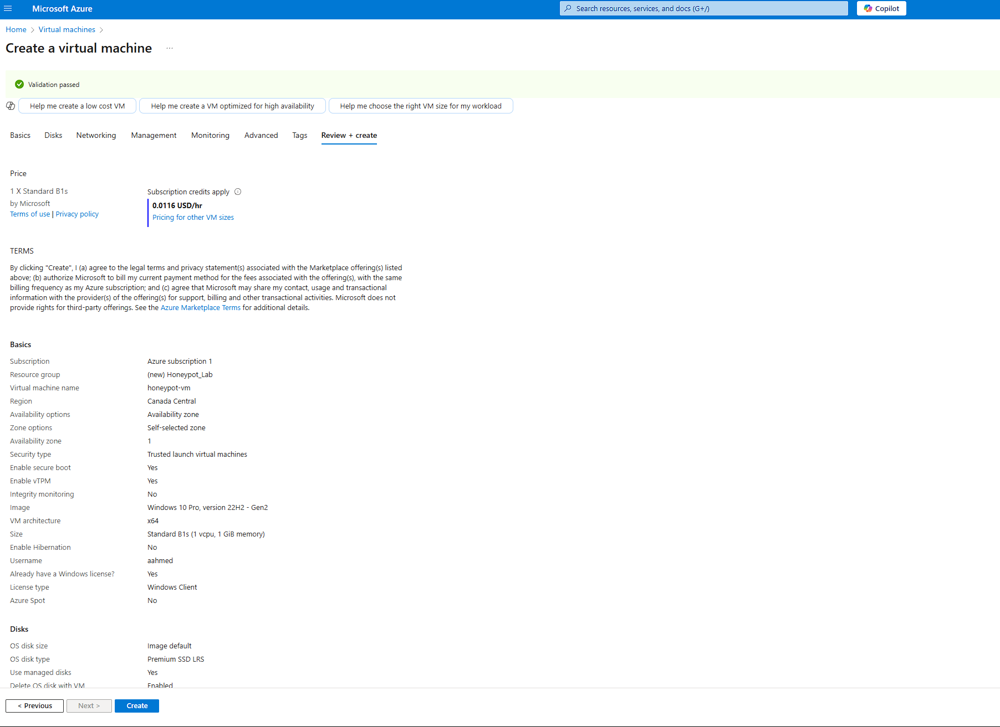
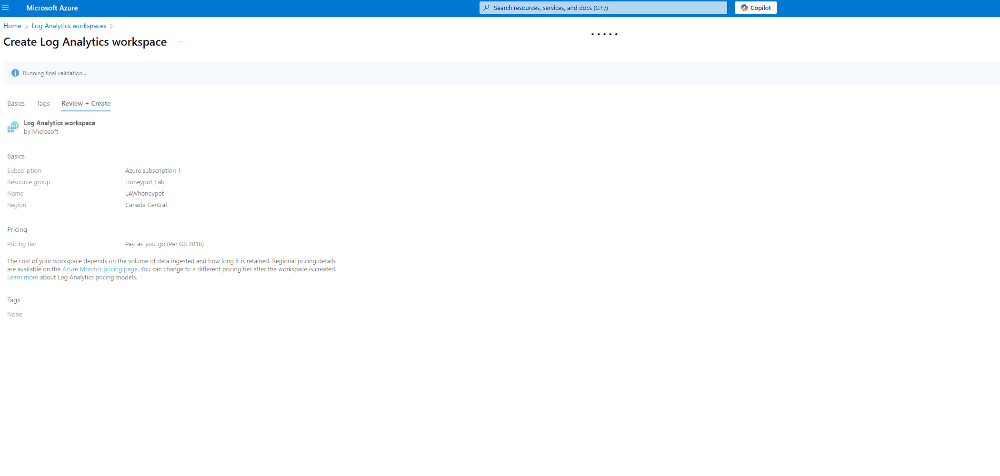
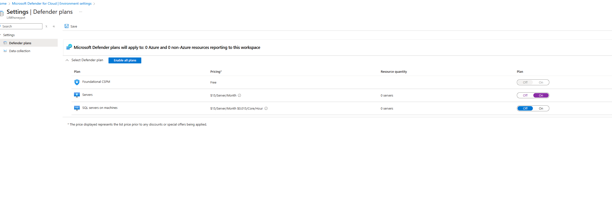
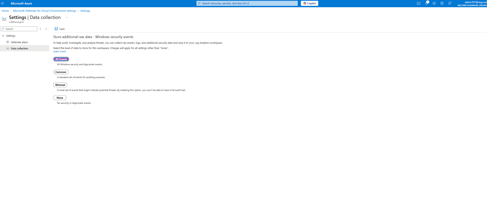
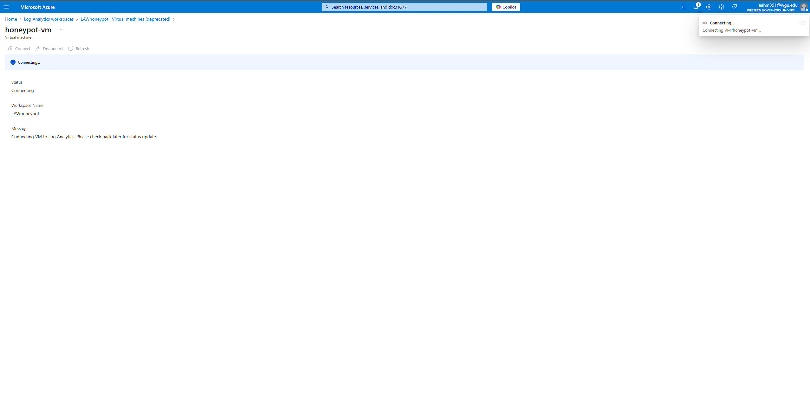
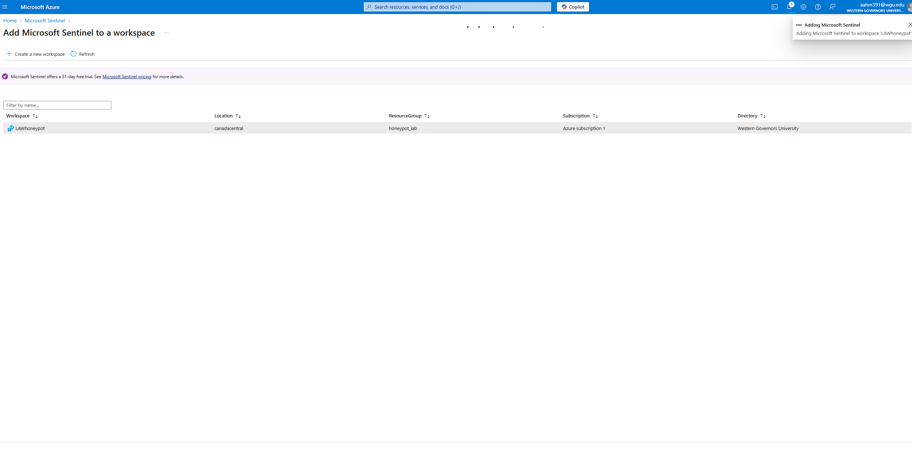

# Project Title: Displaying Live Cyber Attacks on Microsoft Sentinel with a Honeypot  
For this project, I set up a Windows virtual machine (VM) in Azure to act as a honeypot, designed to attract and monitor RDP attacks in real time. I created a log repository in Azure to collect data from the VM and configured Microsoft Sentinel (a SIEM) to display a live map showing the geolocations of the attackers. To dig deeper, I used PowerShell scripts to extract the attackers’ IP addresses from the logs and sent them to an API to gather detailed location information. This data was then used to create custom logs with geographic details. The result was a system that not only tracked live attacks but also provided valuable insights into where they were coming from, making it a great example of using automation and visualization for threat monitoring.

## Utilities Used
- <b>ipgeolocation.io</b>
- <b>Microsoft Azure</b> 
  - <b>Microsoft Sentinel</b>
  - <b>Windows 10 VM</b>
  - <b>Log Analytics</b>
  - <b>PowerShell</b>
  - <b>Windows Event Viewer</b>

---

## Walk Through  

### Step 1: Creating the Virtual Machine (The Honeypot)  
**Description:**  
The first step in the process, after creating a free azure account, is the create and configure our Windows 10 virtual machine! It's important to give it an administrator user and password you'll remember.  

**Image:**  

More importantly, we need to make sure our Windows machine is suceptible to attacks and basically free game to any hackers. Here's me configuring the security group to allow anything into the system.

And here is an image of all the options I selected before creating the VM.

---

### Step 2: Configuring Log Analytics and Microsoft Sentinnel  
**Description:**  
The next step is to create our Log Analytics workspace. This will be used to ingest security event logs from the Windows VM. Later on, we will create a custom log that will give us geographic information to discover our hacker's locations in detail.
**Image:**  
  

Then we want to head to Microsoft Defender so we can enable the ability to gather logs from the VM into the log analytics workspace. We want to collect all events.

  

Next, we want to actually connect our log analytics workspace to our honeypot.

Finally, we are going to connect Microsoft Sentinnel to our log analytics workspace. This is the SIEM we are going to use to visualize the attack data.

---

### Step 3: [Loggin In]  
**Description:**  
Now we can log into our virtual machine! I used RDP through my actual desktop to connect to the VM. All you would do is take the enter the IP address of the VM, then enter the adminstrator username and password.  
If I ping the VM from my actual PC, we can see that there is no reply and the request times out. That's because the VM's firewall is still on. We need to go to the firewall settings and turn everything off, and then we will get a reply back.

**Image:**  
  

---

### Step 4: [Powershell]  
**Description:**  
Here we are going to open up powershell and enter an infinitely looping script. The script will look through the windows security event logs and grab all the attempts of people trying to log in and their IP address. It extracts their geo data and creates a new log file. For this to work, we need a api key from ipgeolocation.io. This is the website that gives us the api key in order to retreive information like country, city, latittude and longitude. All you need to do is go to their website, create an account, get your free api key and insert it into the powershell script.
**Image:**  
  

It creates a file in program data. We will use the contents of this file to train Log Analytics Workspace on what to look for. Now, the file was created inside the VM so we can't import it into Log analytics like that. Instead we can copy the contents and create another file through notepad on our own PC.

---

### Step 5: [Step Title]  
**Description:**  
Write a description of this step, emphasizing its role in the project’s overall workflow.  

**Image:**  
  

---

### Step 6: [Step Title]  
**Description:**  
Outline what was achieved in this step and its contribution to the final goal.  

**Image:**  
  

---

### Step 7: [Step Title]  
**Description:**  
Explain the focus of this step and any specific tools, methods, or configurations used.  

**Image:**  
  

---

### Step 8: [Step Title]  
**Description:**  
Highlight the objectives of this step and describe how they were met.  

**Image:**  
  

---

### Step 9: [Step Title]  
**Description:**  
Provide an in-depth overview of this step and its importance to the project’s success.  

**Image:**  
  

---

### Step 10: [Step Title]  
**Description:**  
Summarize this final step, emphasizing its completion and any key takeaways.  

**Image:**  
  

---

## Conclusion  
Wrap up your project by summarizing its purpose, key outcomes, and future potential. Highlight any challenges overcome and what you learned during the process.  

## Takeaways  
Include steps for anyone interested in running or contributing to your project. Provide setup instructions, prerequisites, and how to reproduce your results
